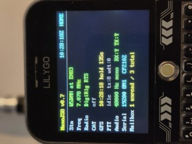
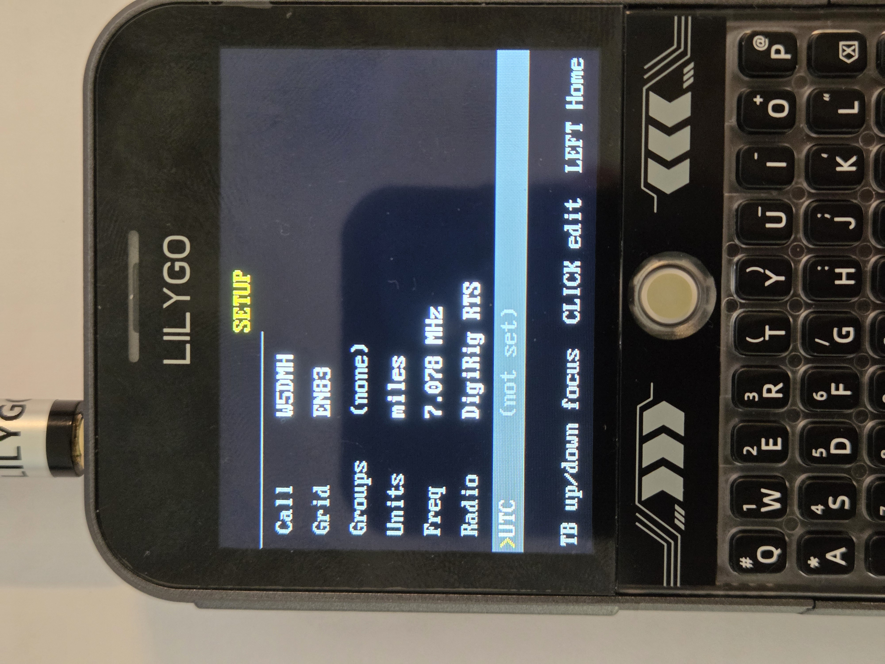
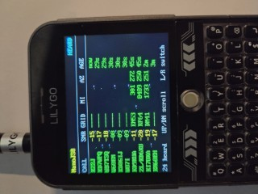
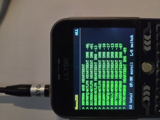
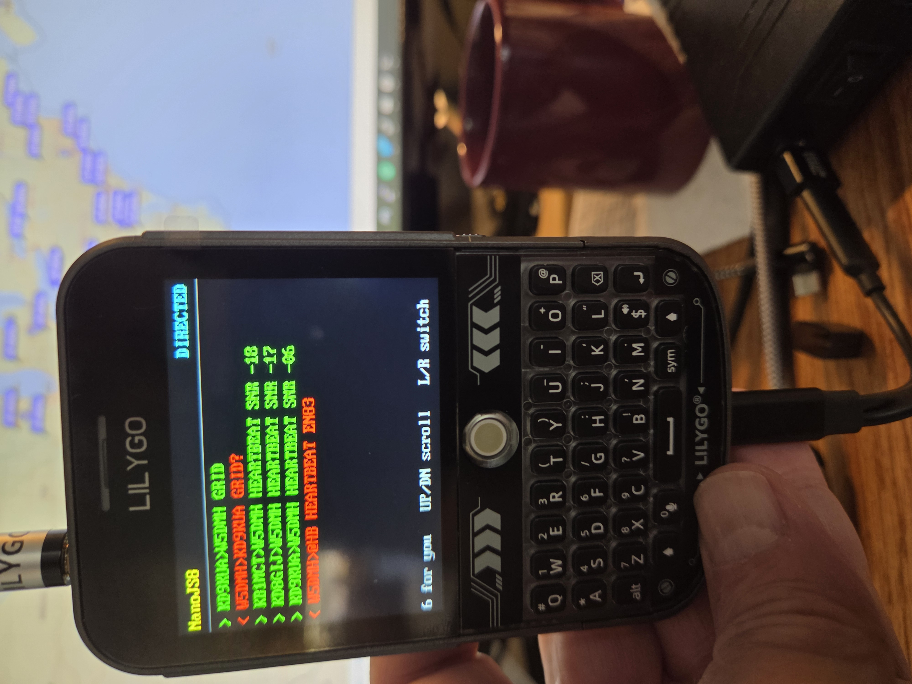
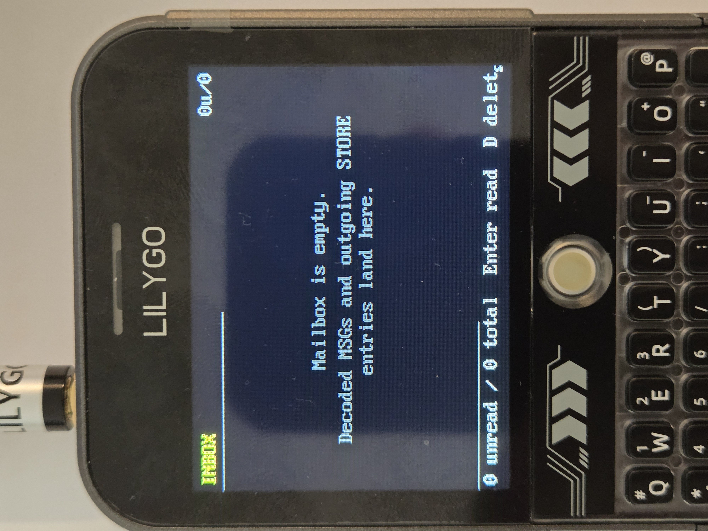
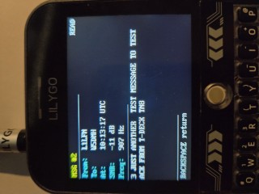
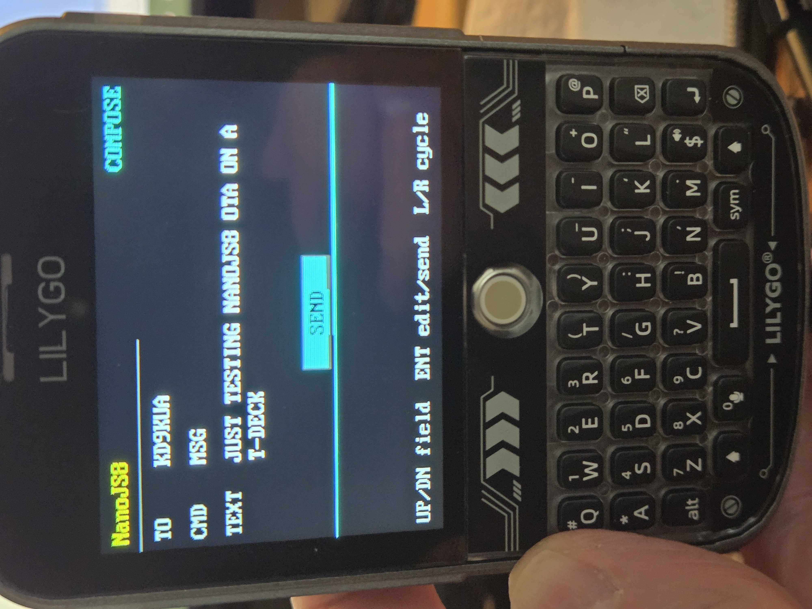
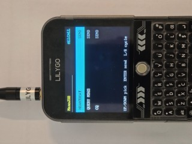

# NanoJS8

A pocket JS8 amateur-radio transceiver firmware for the **LilyGO T-Deck Plus**.

> ### ⚡ [Install NanoJS8 (one click) →](https://w5dmh.github.io/nanojs8/)
> Connect your T-Deck Plus over USB, click the **Install** button. Requires Chrome or Edge on a desktop OS. No build tools, no Python, no command line.

**Status:** Pre-alpha. On-air verified for bidirectional MSG / ACK between W5DMH and KD8PGB on 40 m JS8 Normal. Rough edges remain — see [Status & limitations](#status--limitations).

---

## Hardware required

NanoJS8 is designed for the **LilyGO T-Deck Plus** specifically — the "Plus" variant has the GPS module, 16 MB flash, and 8 MB PSRAM that NanoJS8 depends on. The non-Plus T-Deck lacks PSRAM and won't run this firmware.

| Item | Notes | Where to buy |
|---|---|---|
| **LilyGO T-Deck Plus** | ESP32-S3FN16R8, 16 MB flash, 8 MB PSRAM, on-board u-blox MIA-M10Q GPS | [lilygo.cc](https://lilygo.cc/products/t-deck-plus) |
| **DigiRig Mobile** | USB audio + RTS-PTT (verified). Other USB sound-card adapters with RTS PTT should work but are untested. | [digirig.net](https://digirig.net) |
| **OTG Y-cable** | Lets the T-Deck Plus act as USB host (audio adapter) while still drawing 5 V from a power supply. Without this, the device runs the radio off its tiny internal battery and drains in ~30 minutes. | [Amazon (recommended)](https://www.amazon.com/dp/B098SVSDYW) |
| **USB 5 V power source** | We recommend the **Talentcell Rechargeable 12 V 3000 mAh Lithium-ion Battery Pack** — its 5 V USB output keeps the T-Deck Plus + DigiRig + radio interface fed for many hours of operation in the field. | Talentcell (Amazon) |
| **HF SSB transceiver** | See verified models below. | — |

### Verified radio combinations

| Radio | Profile to select on SETUP | What you get |
|---|---|---|
| **Xiegu G90** | `xiegu-g90-digirig` | RTS PTT + Icom CI-V CAT (HOME screen shows live frequency) |
| **(tr)uSDX** | `digirig-rts-only` | RTS PTT only, no CAT |
| **Baofeng UV-5R** | `digirig-rts-only` | RTS PTT only, no CAT |
| **Quansheng UV-K5** | `digirig-rts-only` | RTS PTT only, no CAT |

If your radio just has a PTT input and accepts SSB audio through its mic jack, `digirig-rts-only` should work — try it. Open an issue if your radio works (or doesn't) so we can extend this table.

---

## Install

**Recommended:** [w5dmh.github.io/nanojs8](https://w5dmh.github.io/nanojs8/) — one-click browser flasher. Chrome or Edge required.

**Manual:** Download `nanojs8-merged.bin` from the [latest release](https://github.com/W5DMH/nanojs8/releases/latest) and:

```bash
esptool.py --chip esp32s3 --port <COM port> write_flash 0x0 nanojs8-merged.bin
```

The merged binary is ~7 MB and includes the bootloader, partition table, application, and JSC dictionary all in one image.

---

## First-boot setup

After flashing, the T-Deck Plus boots into the **SETUP** screen automatically (it detects an unconfigured station and forces you through SETUP before showing HOME). You'll need:
**Click ENTER to edit a field!**
1. **Callsign** — your amateur-radio callsign (uppercased automatically). The default `NOCALL` is a placeholder you must replace.
2. **Maidenhead grid** — your 4 or 6-character locator (e.g. `EN83` or `EN83IH`). Used in your heartbeat broadcasts and to compute distance to stations you hear.
3. **Radio profile** — pick one from the table above (e.g. `digirig-rts-only` for a Baofeng).
4. **Frequency** — set to **7.078 MHz** for the standard JS8 calling frequency on 40 m. Other JS8 frequencies: 14.078 (20m), 21.078 (15m), 28.078 (10m).
5. **UTC time** — Set manually for now via SETUP row 6. Once GPS gets a fix (a few minutes outdoors with sky visibility) it syncs automatically and always wins.

Tune your radio to the frequency you configured, set it to **USB** mode, and connect the DigiRig via the OTG Y-cable. Within a couple of slot intervals (15 s each) you should see traffic appear in the **HEARD** and **ALL** screens if the band is open.

---

## Using NanoJS8 — the nine screens

NanoJS8's UI is a ring of nine screens. Trackball **RIGHT** advances to the next screen, **LEFT** goes back. **UP / DOWN** does context-sensitive work within the current screen (cursor movement, scrolling, focus). Click on the trackball acts like **Enter**.

### The screen ring

```
   ┌─ HOME ⇄ SETUP ⇄ HEARD ⇄ ALL ⇄ DIRECTED ⇄ INBOX ⇄ COMPOSE ⇄ ALLCALL ─┐
   │                                                                       │
   └───────────────────────────────────────────────────────────────────────┘
                                                  ╲
                                                   ╲  (modal, off-ring)
                                                    ▼
                                            INBOX_DETAIL
```

**INBOX_DETAIL** is off the main ring — you enter it from INBOX by pressing **Enter** on a message and leave it with **Backspace** or trackball **LEFT** to return to INBOX.

**Shortcut:** From HOME, trackball **LEFT** jumps directly to DIRECTED (skipping past SETUP through the back of the ring). Most operating happens in DIRECTED / COMPOSE, so this is the fastest path to "do something useful."

---

### HOME — operator status dashboard



A glanceable status panel. Nothing on this screen is editable — its job is to tell you the device is healthy and what mode it's in.

**Rows shown:**

| Row | Meaning |
|---|---|
| **Stn** | Your callsign + grid (from SETUP). White text. |
| **Freq** | Configured operating frequency. Cyan if recent (within 30 s); yellow while CAT request is in flight; red on CAT timeout; gray when no CAT profile is active. |
| **Radio** | Profile name (`DigiRig RTS`, `Xiegu G90`, etc.) |
| **CAT** | CAT status: `CONNECTED` (green), `WAITING` (yellow), `NO REPLY` (red), or `OFF` (gray) |
| **GPS** | `NO FIX` / `2D` / `3D` plus satellite count when a fix is acquired. Time-to-first-fix can be 30 s indoors near a window, several minutes if completely indoors. |
| **PTT** | `idle` or `KEYED` plus running counts of total transmissions and watchdog trips. |
| **Audio** | USB UAC stream status (sample rate, channels, RX:Y/N, TX:Y/N) |
| **Serial** | CDC-ACM USB serial status (CP2102 detected) |
| **Mailbox** | `<unread> unread / <total> total` — quick gauge of how many messages are waiting |

**Header right shows live UTC clock** once time is set, plus the screen name (`HOME`).

**Key controls:**

| Key | What it does |
|---|---|
| Trackball **RIGHT** | Advance ring → SETUP. Four-tick debounced (you have to deliberately roll to switch). |
| Trackball **LEFT** | Shortcut → DIRECTED. Same debounce. |
| **T** / **t** | PTT test pulse — keys PTT for 1 s, then releases. Use this to verify your radio is being keyed correctly. Refused if a real TX is in flight. |
| **P** / **p** | PTT toggle — flips PTT state. Press once to assert, again to release. Useful for sustained testing or to manually de-key. Refused if a real TX is in flight. |
| **X** / **x** | Slot-aligned **HEARTBEAT** transmission — sends `@HB HEARTBEAT <grid4>` on the next 15 s slot boundary. Same as ALLCALL → HEARTBEAT → Enter, kept here as a one-key shortcut. Will key PTT and transmit for real. |

---

### SETUP — operator configuration



The settings screen. Seven editable rows; values are persisted in NVS and survive reboots.

**Rows:**

| Row | Field | Notes |
|---|---|---|
| 0 | **Callsign** | Your amateur callsign. Uppercased on commit. |
| 1 | **Grid** | 4 or 6-char Maidenhead locator (e.g. `EN83IH`). Prefix uppercased, subsquare lowercased. |
| 2 | **Groups** | Comma-separated `@`-prefixed group memberships (e.g. `@GHOSTNET,@SKY`). Determines what shows in DIRECTED. |
| 3 | **Units** | `miles` or `km` — affects distance display in HEARD. |
| 4 | **Freq** | Operating frequency in MHz, dotted (e.g. `7.078`). Sent to the radio via CAT if a CAT-capable profile is active. |
| 5 | **Radio** | Radio profile (e.g. `digirig-rts-only`, `xiegu-g90-digirig`). |
| 6 | **UTC** | Manual UTC entry as `HH:MM:SS`. Volatile (doesn't persist to NVS); GPS overrides whenever it has a fix. |

**Modes:**

The screen has two modes — **IDLE** and **EDIT** — controlled by a state machine.

**IDLE mode** (just looking, focus indicator highlights one row):

| Input | What it does |
|---|---|
| Trackball **UP** / **DOWN** | Move focus between rows (tick-debounced so a single roll doesn't skip rows). |
| Trackball **CLICK** or keyboard **Enter** | Enter EDIT mode for the focused row. |
| Trackball **LEFT** | Exit ring → HOME (only if station is configured; otherwise you can't leave SETUP). |
| Trackball **RIGHT** | Advance ring → HEARD. |

**EDIT mode** (yellow background on the row, cursor visible):

| Input | What it does |
|---|---|
| Any printable character | Append to the edit buffer. |
| **Backspace** (0x08) | Delete the last character. |
| **Enter** (0x0D) or trackball **CLICK** | Validate the value and commit. On invalid input a red banner appears and you stay in EDIT mode. |
| **Escape** (0x1B) | Cancel — discard buffer, return to IDLE. |
| Trackball motion | Ignored. Commit or cancel before navigating. |

**Validation:** Callsign must match standard amateur regex; grid must be a valid Maidenhead string; frequency must parse to a valid MHz value. Failures show a red `Invalid value` banner and the field stays in EDIT mode until you fix it or press Escape.

**Save behavior:** Each row commits on Enter individually (no separate "save all" step). Successful commits show a green `Saved` banner for ~1.5 s. Callsign / grid normalization happens automatically.

---

### HEARD — recently-heard callsigns



A live table of every callsign whose signal has been decoded recently. Columns mirror MicroJS8.

**Columns:**

| Column | Width | Meaning |
|---|---|---|
| **CALL** | 8 char | Decoded callsign |
| **SNR** | 3 char | Real radio SNR in dB, computed from the Costas sync tones. Color-coded: green ≥-10 (strong), yellow -20 to -10 (workable), gray <-20 (marginal). |
| **GRID** | 6 char | Their reported Maidenhead grid, if they've sent one |
| **MI** | 5 char | Distance from your grid to theirs, in miles or km (per your SETUP setting). Blank if either grid is unknown. |
| **AZ** | 3 char | Azimuth (bearing) to that station in degrees |
| **AGE** | 5 char | How long since you last heard them (e.g. `2m`, `15s`, `1h`) — updates live every render |

Sorted newest-first. Holds up to 32 stations; older entries age off the bottom. Backed by `nanojs8_activity` HEARD table (BSS-allocated, persists across reboots? No — heard table is volatile, INBOX is the persistent one).

**Key controls:**

| Key | What it does |
|---|---|
| Trackball **LEFT** | Back in ring → SETUP |
| Trackball **RIGHT** | Forward in ring → ALL |
| Trackball **UP** / **DOWN** | Scroll the list (when more than 12 entries) |

---

### ALL — full activity log



Chat-style log of every protocol verb you've decoded. Newest at top. Both heartbeats and directed messages appear here — this is the "firehose" view. Long bodies wrap onto continuation lines indented under the verb.

**Display format:**

```
> HH:MM:SS  FROM     VERB body         ← heartbeat (no TO)
> HH:MM:SS  FROM>TO  VERB body         ← directed
```

Wrap indent is 3 chars past the direction marker so wrapped body lines clearly read as subordinate. Each entry is capped at 3 visible rows total; longer messages get a `...` truncation marker.

**Key controls:**

| Key | What it does |
|---|---|
| Trackball **LEFT** | Back in ring → HEARD |
| Trackball **RIGHT** | Forward in ring → DIRECTED |
| Trackball **UP** / **DOWN** | Scroll up/down. Tick-debounced; a single trackball roll doesn't cycle through five screens. |

---

### DIRECTED — filtered to messages for you



Same layout as ALL, but only entries addressed to you or to a group you belong to. Use this as your "things I care about" view — heartbeats and `@ALLCALL` chatter are filtered out so the screen stays quiet until something is actually for you.

**Filter rules:**

| Filter result | What happens |
|---|---|
| `to_call == my callsign` (case-insensitive) | Show |
| `to_call == @<group>` and `<group>` is in your Groups list | Show |
| `to_call == @ALLCALL` or `@HB` | Drop |
| `to_call` empty (heartbeat) | Drop |

So configuring your Groups in SETUP (e.g. `@GHOSTNET`) materially controls what appears here.

**Key controls:**

| Key | What it does |
|---|---|
| Trackball **LEFT** | Back in ring → ALL |
| Trackball **RIGHT** | Forward in ring → INBOX |
| Trackball **UP** / **DOWN** | Scroll list, tick-debounced |

---

### INBOX — message mailbox



Lists every message held by the on-device mailbox, across all four lifecycle states. Backed by NVS, so messages survive reboots.

**Lifecycle states & visual encoding:**

| State | Prefix | Call shown | Color | Meaning |
|---|---|---|---|---|
| **UNREAD** | `>` | sender | white | An inbound message you haven't opened yet |
| **READ** | (space) | sender | gray | Inbound, already opened |
| **STORE** | `<` | recipient | yellow | Outbound message we're holding for relay |
| **DELIVERED** | (space) | recipient | gray | Outbound that's been relayed successfully |

The `>` marker means "incoming, look here"; `<` means "we're holding this for an outbound peer." The call column shows the *other party* (sender for inbound, recipient for outbound) so your eye lands on the relevant callsign regardless of direction.

**Layout:**

```
INBOX                            3u/12  HH:MM
─────────────────────────────────────────
> KB1MCT      -09  18:42
  Hello there how have you been today...
< KW3KW       ---  18:38
  73 see you again later when we meet
  ...
─────────────────────────────────────────
3 unread / 12 total · Enter read · D delete
```

**Cursor:** A 2-pixel cyan bar to the left of the selected entry indicates the cursor. Move it with trackball UP/DOWN.

**Key controls:**

| Key | What it does |
|---|---|
| Trackball **LEFT** | Back in ring → DIRECTED |
| Trackball **RIGHT** | Forward in ring → COMPOSE |
| Trackball **UP** / **DOWN** | Move cursor up / down (single-tick — list nav is fine-grained, no debounce) |
| **Enter** (0x0D) | Open INBOX_DETAIL on the selected entry. If the entry is UNREAD, automatically marks it as READ before transitioning. |
| **D** / **d** | Delete the selected entry — two-press confirmation. First press arms "pending delete" mode (footer changes to `Press D again · any other key cancels`). Second D within 5 s commits. Any other key cancels. |

---

### INBOX_DETAIL — full message view (modal)



Off-ring modal showing the full text of one message plus metadata. Reached from INBOX by pressing **Enter** on a selected entry.

**Layout:**

```
MSG #14                              UNREAD
─────────────────────────────────────────
From:  KB1MCT
To:    W5DMH
At:    18:42:15
SNR:   -09 dB
Freq:  573 Hz
─────────────────────────────────────────

Hello there how have you been today.
I tried to call you on 20m yesterday
but no joy.

─────────────────────────────────────────
BACKSPACE  return
```

**Body wrapping:** 38 chars per line, at word boundaries when possible. Long messages scroll if they exceed the visible content area.

**Edge cases:**
- If the entry has been deleted by another task between INBOX's `mark_read()` and INBOX_DETAIL's render, the screen shows a `no longer available` notice. Backspace still returns to INBOX normally.

**Key controls:**

| Key | What it does |
|---|---|
| **Backspace** (0x08) | Return to INBOX |
| Trackball **LEFT** | Return to INBOX |
| (All other keys ignored) | INBOX_DETAIL is read-only; you can't reply from here — go to COMPOSE for that. |

---

### COMPOSE — outgoing message form



Multi-field form for sending any of the 10 JS8 verbs. Mirrors MicroJS8's compose screen.

**Verbs supported:**

| Verb | Wire format | Use case |
|---|---|---|
| **FREE** | `<TO> <TEXT>` | Free-form directed conversation |
| **MSG** | `<TO> MSG <TEXT>` | Buffered mail — the receiver stores it in their INBOX and auto-ACKs |
| **MSG TO** | `<TO> MSG TO:<FOR> <TEXT>` | Relay — ask `<TO>` to forward to `<FOR>` |
| **STORE** | (local, no TX) | Write a message to your local mailbox for later retrieval |
| **AGN?** | `<TO> AGN?` | Ask the station to retransmit |
| **SNR?** | `<TO> SNR?` | Ask for a signal report |
| **GRID?** | `<TO> GRID?` | Ask for the station's grid square |
| **QUERY MSGS** | `<TO> QUERY MSGS` | Ask if the station is holding any mail for me |
| **QUERY MSG** | `<TO> QUERY MSG <id>` | Fetch a specific stored message by id |
| **MYLOC** | `<TO> MSG MYLOC <coords>` | Share your current location |

**Fields:**

| Field | Notes |
|---|---|
| **TO** | Callsign (e.g. `KD8PGB`) or group (e.g. `@GHOSTNET`). Free-typed or picked from HEARD list. |
| **CMD** | Verb dropdown (the 10 verbs above) |
| **FOR** | Only appears when CMD = MSG TO. The ultimate recipient for relay. |
| **TEXT** | Free-text body (or numeric ID for QUERY MSG) |
| **SEND** | Fire button (TX or STORE depending on CMD) |

**Modes:**

The screen has two modes — **NAV** and **EDIT** — same pattern as SETUP.

**NAV mode** (default on entry, focused-field highlighted):

| Input | What it does |
|---|---|
| Trackball **UP** / **DOWN** | Previous / next field |
| Trackball **LEFT** | Back in ring → INBOX |
| Trackball **RIGHT** | Forward in ring → ALLCALL |
| Trackball **CLICK** or **Enter** | Enter EDIT mode on focused field. On SEND focus, fires the transmission. |

**EDIT mode** (typing into a field):

For **TO / FOR** fields:

| Input | What it does |
|---|---|
| Printable characters | Append to buffer (uppercased on commit) |
| Trackball **UP** / **DOWN** | Cycle through HEARD list + configured @groups (newest HEARD callsigns first; groups marked with leading `*` in display only) |
| **Enter** / trackball **CLICK** | Commit + return to NAV |
| **Escape** (0x1B) | Cancel + return to NAV (revert buffer) |
| **Backspace** (0x08) | Delete last character |

For **CMD** field:

| Input | What it does |
|---|---|
| Trackball **UP** | Previous verb (wraps around) |
| Trackball **DOWN** | Next verb (wraps around) |
| **Enter** / trackball **CLICK** | Commit + return to NAV |
| **Escape** | Cancel + return to NAV |

For **TEXT** field: same as TO/FOR, but the trackball UP/DOWN HEARD-picker is disabled (it would be confusing in free-text editing).

**TX warnings** (shown in footer-right, priority-ordered):

1. TO empty → `TO callsign required`
2. FOR empty (MSG TO only) → `FOR callsign required`
3. TO == your own callsign (non-STORE) → `TO cannot be your own call`
4. MSG TO with FOR == TO → `FOR cannot equal TO`
5. QUERY MSG with non-numeric TEXT → `MSG ID must be a number`
6. No active radio profile → `TX OFF — configure radio`

The first applicable warning prevents SEND from firing.

---

### ALLCALL — one-touch broadcasts



Three pre-built broadcast actions, each fires on a single Enter keypress.

**Layout:**

```
NanoJS8                       ALLCALL
────────────────────────────────────────

    HEARTBEAT                  SEND     ← focused row

    QUERY MSGS                 SEND

    CQ                         SEND

────────────────────────────────────────
UP/DOWN pick  ENTER send  L/R cycle
```

**The three actions:**

| Row | Wire format | When to use |
|---|---|---|
| **HEARTBEAT** | `@HB HEARTBEAT <grid4>` (or just `@HB HEARTBEAT` if grid unset) | Announce your presence on the band. Standard JS8 pattern: send a heartbeat every 5-10 minutes when listening. |
| **QUERY MSGS** | `@ALLCALL QUERY MSGS` | Ask any listening station if they're holding mail for you |
| **CQ** | `CQ CQ CQ <grid4>` | Standard CQ call. Refused if grid not configured — a CQ without a locator is meaningless. |

All three are **single-shot** transmissions — they fire once on Enter. To repeat, press Enter again. Scheduled-cadence heartbeats (every 20 min, every hour, like MicroJS8's HbMode) are a future feature.

**Key controls:**

| Key | What it does |
|---|---|
| Trackball **UP** / **DOWN** | Move focus between the three rows. Tick-debounced. |
| Trackball **CLICK** or **Enter** | Fire the focused row's transmission. |
| Trackball **LEFT** | Back in ring → COMPOSE |
| Trackball **RIGHT** | Forward in ring → HOME (closes the ring) |

---

## Typical scenarios

**Send a heartbeat so people know you're listening:** From any screen, navigate to **ALLCALL**, ensure HEARTBEAT is focused (it's the default), press Enter. Or shortcut: on **HOME**, press **X**.

**Call a specific station:** Go to **COMPOSE**, click TO, type their callsign, Enter. Click CMD, pick `FREE`, Enter. Click TEXT, type your message, Enter. Click SEND, Enter.

**Read messages waiting for you:** Go to **INBOX**, scroll to the message (trackball UP/DOWN), press Enter to open the full text. Backspace returns to INBOX, and the message is automatically marked as READ.

**Send a buffered message that will auto-ACK on delivery:** COMPOSE → TO: their callsign → CMD: `MSG` → TEXT: your message → SEND. The receiver's auto-ACK comes back in their INBOX detail.

**Ask "is the band open right now?":** Go to HEARD. If there are recent entries (AGE < a few minutes) at workable SNRs (yellow / green), yes. Empty HEARD usually means a quiet band, but also check your audio level on HOME (the Audio row should show RX:Y).

---

## Status & limitations

✅ **Working today:**
- JS8 Normal mode RX with full LDPC decode
- Multi-frame MSG reception and re-assembly
- Auto-ACK on received MSG verbs
- Multi-frame TX (up to 7+ frames verified)
- INBOX with NVS persistence across reboots
- Heartbeat TX
- HEARD / DIRECTED / ALL activity screens
- GPS UTC sync (T-Deck Plus on-board u-blox MIA-M10Q)
- DigiRig + Xiegu G90 CAT via Icom CI-V

🚧 **Known limitations:**
- JS8 Normal mode only — Slow / Fast / Turbo not yet implemented
- Sensitivity is below desktop JS8Call by ~3-6 dB depending on conditions
- Audio level handling is manual — peak input above ~28000 starts clipping and reducing decode margin. No automatic warning yet; watch your radio's AF gain.
- Compound callsigns with slash prefix (e.g. `KH6/W5DMH`) display as `<...>` in HEARD until you've heard the originator declare the compound form
- LoRa radio (SX1262) is held in reset — not yet a usable interface
- Touch screen is unused; trackball + keyboard only
- Scheduled-cadence heartbeats (auto-repeat every N minutes) not yet implemented

❌ **Not yet:**
- Direct FT8 or other digital-mode interop
- Internet / APRS-IS gateway

---

## Reporting bugs & feedback

NanoJS8 is in active development — your reports are how I find issues that don't show up in my own testing.

- **Bug reports / feature requests:** [github.com/W5DMH/nanojs8/issues](https://github.com/W5DMH/nanojs8/issues)
- **Test net:** `@GHOSTNET` group on 40 m JS8 Normal (7.078 MHz USB)
- **Direct contact:** Dan W5DMH · grid EN83

When reporting an issue, please include the firmware version (shown on the bootloader banner; the latest is also at the top of [the install page](https://w5dmh.github.io/nanojs8/)), what radio + audio adapter you're using, what you tried to do, and what happened instead.

---

## License & acknowledgments

**GPL-3.0.** Source at [github.com/W5DMH/nanojs8](https://github.com/W5DMH/nanojs8). Inherits from:

- **JS8Call** (Jordan Sherer KN4CRD and team) — the protocol, the reference implementation, and the JSC dictionary
- **FT8 / FT4 / JT9** (Joe Taylor K1JT) — the LDPC + Costas family that JS8 builds on
- **ft8_lib** (Karlis Goba YL3JG) — our embedded LDPC and Costas base
- **gfsk8-modem-clean** (Jeff Francis) — the cleanroom JS8 modem
- **LilyGO** — the T-Deck Plus hardware

Dan W5DMH · grid EN83 · 73
